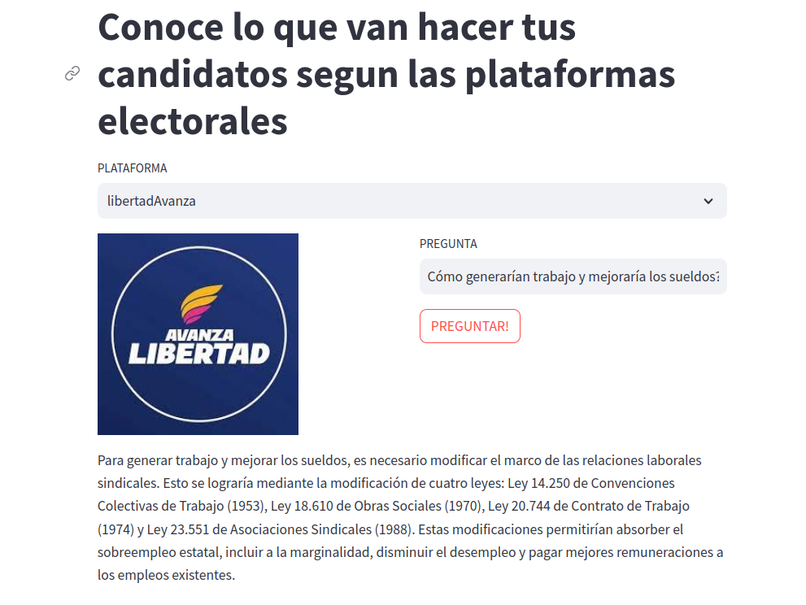

# Plataformas-Electorales-AI-2023
Herramienta AI de tipo  Qestion/Answering (QA)  para utilizar con plataformas electorales Argentinas 2023
Construida utilizando langChain y openAI.

### Deploy

1) Una vez descargado o clonado el ropositorio localmente, crear un ambiente virtual con venv 

    `python3 -m venv <myenv>`
  
   Luego activarlo
  
    `source <myenv>/bin/activate`
  
 2) Instalar todos los modulos necesario, para ello se puede utilizar la herramienta pip
  
    `pip3 install -r requirements.txt`
    

  
### Ejecucion
  
   `streamlit run main.py`

Una vez levantado localmente en el browser (http://localhost:8501/)

a) Poner la api key de openAI

b) seleccionar la plataforma

c) Finalmente realizar la pregunta 

   
